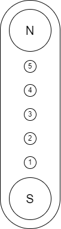

# ZSWatch-Dock

## Table of Contents

- [ZSWatch-Dock](#zswatch-dock)
  - [Table of Contents](#table-of-contents)
  - [About](#about)
  - [Configurations](#configurations)
  - [Dock connector](#dock-connector)
  - [Directory structure](#directory-structure)
  - [Purchasing](#purchasing)
  - [Maintainer](#maintainer)

## About

Programming and charging dock for the [ZSWatch](https://github.com/jakkra/ZSWatch).

Please check the [wiki](https://github.com/jakkra/ZSWatch/wiki) for more information about the project.

## Configurations

The dock can be used with an integrated Segger J-Link debugger or with an external Serial Wire Debugger (SWD) with an [10-pol ARM Cortex JTAG SWD](https://developer.arm.com/documentation/101416/0100/Hardware-Description/Target-Interfaces/Cortex-Debug--10-pin-) connector.

## Dock connector

The pinout for the dock connector is shown below.

<table class="tg">
<thead>
  <tr>
    <th class="tg-0pky"></th>
    <th class="tg-0pky">Pin</th>
    <th class="tg-0pky">Description</th>
  </tr>
</thead>
<tbody>
  <tr>
    <td class="tg-0pky" rowspan="5"></td>
    <td class="tg-0pky">1</td>
    <td class="tg-0pky">VBUS (+5 V)</td>
  </tr>
  <tr>
    <td class="tg-0pky">2</td>
    <td class="tg-0pky">GND</td>
  </tr>
  <tr>
    <td class="tg-0pky">3</td>
    <td class="tg-0pky">SEL</td>
  </tr>
  <tr>
    <td class="tg-0lax">4</td>
    <td class="tg-0lax">D- / SWDIO</td>
  </tr>
  <tr>
    <td class="tg-0lax">5</td>
    <td class="tg-0lax">D+ / SWDCLK</td>
  </tr>
</tbody>
</table>

| SEL  | Function       |
|------|----------------|
|`LOW` | USB            |
|`HIGH`| SWD (Default)  |

## Directory structure

- `cad`: 3D model of the complete PCB
- `docs`: All kind of project documentation
- `project`: KiCad project for the PCB

## Purchasing

Please open `ZSWatch-Dock-navigate.html` and use the files listed under `purchasing` for ordering a PCB.

## Maintainer

- [Daniel Kampert](mailto:daniel.kameprt@kampis-elektroecke.de)
- [Jakob Krantz](mail@jakobkrantz.se)
